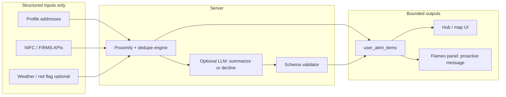

# ANISHA — Flameo: Chatbot → Agentic AI (Implementation Spec)

**Status:** Implementation roadmap (extends partial builds in repo).  
**Continues:** [ANISHA_automation-evacmap-checkin-agentic-alerts.md](./ANISHA_automation-evacmap-checkin-agentic-alerts.md) (§5 agentic alerts), [app/api/ai/route.ts](../app/api/ai/route.ts) (Flameo + COMMAND-INTEL personas), [components/FlameoChat.tsx](../components/FlameoChat.tsx).  
**Index:** [ANISHA_00_INDEX.md](./ANISHA_00_INDEX.md)

**Purpose:** Define how **Flameo** (and **COMMAND-INTEL** for responders) moves from **reactive chat** (`POST /api/ai` with user messages only) to **agentic** behavior: **proactive surfacing**, **bounded actions**, **explicit failure modes**, and **workload reduction** aligned with judging rubrics.

---

## 1. Rubric mapping (what “agentic” means here)

| Rubric expectation | Engineering meaning in this app |
|-------------------|----------------------------------|
| **Acts, not only responds** | Server + client run **triggers** (login, hub mount, interval) that **invoke tools** (routes, shelter lookup, map deep links) without waiting for a user prompt. Chat remains one *surface*; **actions** also appear as **cards, banners, and pre-filled chat turns**. |
| **Proactive on login** | After auth + profile load: **geocode** `profiles.address` (or monitored addresses), fetch **NIFC / FIRMS** (existing APIs), compute **min distance** to incidents. If inside radius **R** (`alert_radius_miles` / Settings), enqueue **structured alert** + optional **Flameo briefing** (see §5). |
| **Bounded action** | Each automation returns a **small fixed schema**: e.g. `{ threat_level, distance_mi, incident_ids[], shelter_id?, route_hint? }`. UI offers **one-tap actions**: “Show on map”, “Open shelters”, “Start check-in”. **No unbounded web browsing** in v1. |
| **Defined failure modes** | **No model-invented fires**: LLM only **narrates** rows already returned by `/api/fires/nifc`, `/api/fires/firms`, etc. Validator **rejects** assistant output that references unknown `fire_id`. Fallback copy: *“No confirmed fire activity within your alert radius right now.”* |
| **Reduces human workload** | Caregiver/evacuee **does not** have to open FIRMS or interpret raw lists: **My Alerts** + **Flameo briefing** summarize **with sources**. Responder gets **COMMAND-INTEL** briefings tied to **jurisdiction / station anchor** (existing responder hub patterns). |

---

## 2. Current state (repo facts)

| Piece | Location | Behavior today |
|-------|----------|------------------|
| Flameo UI | `components/FlameoChat.tsx`, `app/dashboard/caregiver/ai/page.tsx`, `app/m/MobileFlameo.tsx` | User-initiated messages; intro is static. |
| AI API | `app/api/ai/route.ts` | Anthropic `messages.create`, personas `FLAMEO` and `COMMAND-INTEL`; **no tools**, **no server-side fire fetch** in the request path. |
| Agentic alerts (partial) | `ANISHA_automation-evacmap-checkin-agentic-alerts.md` §5, `app/api/alerts/ai-summarize/route.ts`, `user_alert_items`, `NEXT_PUBLIC_ALERTS_AI` | **Structured** summaries **after** baseline proximity detection; gated by env + user toggle. |
| Feature flag | `lib/alerts-ai-feature.ts` | `isAlertsAiDeploymentEnabled()`. |

**Gap:** Flameo is still **not** wired to **automatically** run on login or to **execute** navigation/actions; it **only** answers when the user sends a message.

---

## 3. Target architecture: perceive → decide → act (bounded)



**Rule:** The **LLM never replaces** the proximity engine. It **may** format text, suggest **actions from a fixed menu**, or respond *“insufficient data”*—it **may not** introduce new incident coordinates or IDs.

---

## 4. Proactive triggers (when the agent runs without a user message)

| Trigger | Who | Implementation notes |
|---------|-----|------------------------|
| **Post-login / hub mount** | Caregiver, evacuee | Client: `useEffect` on `/dashboard/caregiver`, `/dashboard/evacuee` calls `GET /api/alerts/refresh` or a dedicated **`GET /api/flameo/context`** that returns `{ alerts[], flameo_prologue }`. Server uses **same** address + radius logic as §5.2 in automation doc. |
| **Session revisit** (optional) | All | Interval **15–30 min** while app focused (or SW cron later): re-fetch FIRMS/NIFC if **dedupe_key** not expired. |
| **Responder hub / COMMAND-INTEL** | `emergency_responder` | On `/dashboard/responder` load: attach **station anchor** (profile / geolocation — already in `useResponderStationAnchor`) + **NIFC slice**; push a **COMMAND-INTEL briefing** object to UI state (not only chat). |

**Flameo chat UX:** If `flameo_prologue` is non-empty, **prepend** or **replace** the first assistant bubble for the session (dedupe via `sessionStorage` key `wfa_flameo_prologue_shown_${date}`) so users see **one** proactive briefing per day unless severity increases.

---

## 5. Bounded actions (examples by role)

### 5.1 Evacuee (self)

| Condition (from data, not LLM) | Bounded action | UI / route |
|-------------------------------|----------------|------------|
| Nearest incident **< R miles** | Show evacuation **context card** + link | `EvacuationMapExperience` with `?focus=fire&id=` or hub `panel=alerts` |
| Shelters available | **Nearest shelter** row (distance sorted) | Reuse `/api/shelters` + client sort by distance from anchor |
| “Route” v1 | **Open in Maps** external deep link (Google/Apple) from **address → shelter** (user device); **no** hallucinated turn-by-turn | Button: `Open directions` |

**LLM role:** Phrase the card (“Fire activity **confirmed** within X mi…”) and **list sources**; **numbers** come from engine output only.

### 5.2 Caregiver (self + monitored persons)

| Condition | Bounded action |
|-----------|----------------|
| Fire within R of **monitored address** | Per-person **alert row** + optional “**Ask Flameo about [Name]**” prefill |
| Multiple addresses | **Dedupe** per `anchor_id` + `fire_id` (see automation doc §5.5) |

**Workload reduction:** Single **My Alerts** stream; caregiver does **not** query FIRMS manually.

### 5.3 Emergency responder (COMMAND-INTEL)

| Condition | Bounded action |
|-----------|----------------|
| Incidents in jurisdiction / near station | **Intel card** on hub or `/dashboard/responder/analytics` with **links** to existing ICS route (`/dashboard/responder/ics`) and **NIFC list** |
| No data | **Explicit** “No confirmed incidents in feed” (not a vague chat reply) |

Persona **`COMMAND-INTEL`** in `app/api/ai/route.ts` stays the **voice**; **new** proactive briefings should use the **same** structured context injection as Flameo (see §7).

---

## 6. Failure modes (required behaviors)

| Scenario | User-facing behavior | Technical |
|----------|----------------------|-----------|
| **No API keys** / FIRMS unreachable | Show **rule-based** proximity only or **“Weather/fire feeds unavailable”** | Catch `fetch` errors; do not call LLM for “creative” incident data. |
| **LLM timeout / 429** | Static template: *“We couldn’t generate an AI summary; here’s what we know: [distance, source].”* | Same as partial failure in `ai-summarize` patterns. |
| **Model claims unknown fire** | **Discard** or **regenerate** with stricter prompt; max 1 retry | Post-parse validator: every `incident_id` ∈ input set. |
| **Address missing** | Block consumer flows that require geocoding; Settings already enforces address for some roles — **Flameo proactive** should **skip** with copy: *“Add your home address in Settings to enable proximity alerts.”* |
| **Ambiguous location** | “**No confirmed data** within your alert radius” | Do not infer fires from free text user messages without API backing (chat remains educational only for “what if” questions). |

---

## 7. Data contract: `FlameoContext` (suggested payload)

Server builds **JSON** (no PII in prompts beyond what’s already in profile):

```typescript
// Conceptual — implement in lib/flameo-context.ts
interface FlameoContext {
  role: 'caregiver' | 'evacuee' | 'emergency_responder'
  anchors: { id: string; label: string; lat: number; lon: number }[]
  incidents_nearby: {
    id: string
    source: 'nifc' | 'firms'
    distance_miles: number
    name: string | null
    lat: number
    lon: number
  }[]
  weather_summary?: { temp_f: number | null; wind_mph: number | null; fire_risk: string } | null
  flags: {
    has_confirmed_threat: boolean  // true iff incidents_nearby.length > 0 inside R
    no_data: boolean
  }
}
```

**LLM prompt rule:** *“You may only reference incidents from `incidents_nearby`. If `flags.has_confirmed_threat` is false, say clearly that no confirmed activity is within radius.”*

---

## 8. API surface (implementation phases)

### Phase A — Context endpoint (no new model)

- **`GET /api/flameo/context`** (or merge into existing alerts refresh): returns `FlameoContext` + optional **template** string for UI (no LLM).
- **Client:** Hub + `FlameoChat` call on mount; pass `flameo_prologue` into chat state.

### Phase B — Proactive LLM summary (bounded)

- **`POST /api/flameo/briefing`**: body `{ context: FlameoContext }` (server **re-fetches** or trusts signed session payload — **prefer server re-fetch** to avoid tampering).
- Uses Anthropic with **JSON output schema** + validator; stores **optional** row in `user_alert_items` type `flameo_briefing` for history.

### Phase C — Tool-style actions in chat (optional)

- Extend `/api/ai` with **tool use** (Anthropic tools): `open_map`, `list_shelters`, `open_checkin` — each maps to **known** client callbacks via **structured** response the UI interprets (e.g. `{ tool: 'open_map', args: { lat, lon, zoom } }`). **Do not** execute arbitrary URLs from the model.

### Phase D — Responder COMMAND-INTEL parity

- Same pipeline with `role: 'emergency_responder'` and **COMMAND-INTEL** system prompt; surface on **responder hub** strip + optional chat prefill.

---

## 9. UI integration checklist

- [ ] **My Hub / evacuee hub:** Banner or top card when `flags.has_confirmed_threat` (reuse alerts panel).
- [ ] **FlameoChat:** Inject proactive first message from `GET /api/flameo/context` (with daily dedupe).
- [ ] **Settings:** Already wired for radius + AI toggle — document dependency in `.env.example` (`NEXT_PUBLIC_ALERTS_AI`).
- [ ] **Mobile:** Mirror proactive briefing in `MobileFlameo` + hub (`/m/dashboard/*`).

---

## 10. Security & privacy

- **Minimize PII in prompts:** Use “Location A” + server-side id mapping where possible (per automation doc §5.3).
- **Rate limits:** Reuse `checkRateLimit` from `app/api/ai/route.ts` for new routes; stricter for **cron** if added.
- **Audit:** Log `user_id`, `source_api`, `incident_ids` on each briefing for demo/debug.

---

## 11. References

| Doc / file | Relevance |
|------------|-----------|
| [ANISHA_automation-evacmap-checkin-agentic-alerts.md](./ANISHA_automation-evacmap-checkin-agentic-alerts.md) | Baseline proximity, `user_alert_items`, AI summary gate |
| [app/api/ai/route.ts](../app/api/ai/route.ts) | Personas, rate limits |
| [hooks/useResponderStationAnchor.ts](../hooks/useResponderStationAnchor.ts) | Responder anchor for COMMAND-INTEL context |
| [lib/alerts-ai-feature.ts](../lib/alerts-ai-feature.ts) | Deployment flag for AI layers |

---

**Last updated:** 2026-03-27
